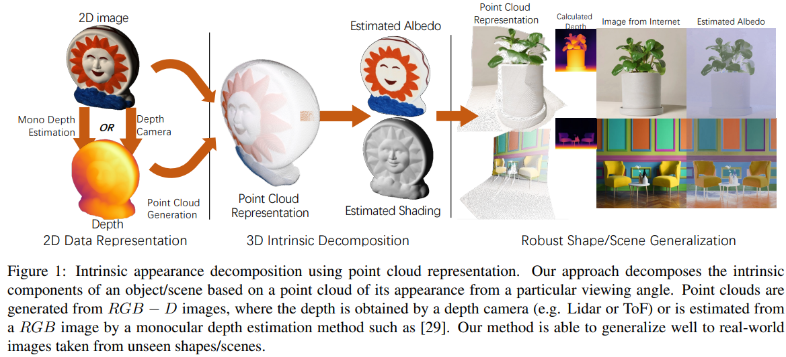

# PoInt-Net (CV4Metaverse Workshop @ ICCV 2023)
Official Implementation For Paper Intrinsic Appearance Decomposition Using Point Cloud Representation

## News:

[08, Sept. 2023] The code is released.

[16, Aug. 2023] Our work is accepted by the CV4Metaverse workshop, ICCV 2023.



## Requirements

- Python 3.7+
- Pytorch
- numpy
- scipy
- scikit-learn
- scikit-image
- MiDaS

## Data Preparation

**With depth:**

- Run depth2normal.py to precompute the surface normal.
- Run img2pcd.py to preprocess the rgb-d image to point cloud.

**Without depth:**

- Go to [MiDaS](https://github.com/isl-org/MiDaS) to precompute the depth （or any other depth estimation model）
- Run depth2normal.py to precompute the surface normal.
- Run img2pcd.py to preprocess the rgb-d image to point cloud.

## Evaluation

- Run test.py to decompose the albedo and shading. (We provide example data in folder: Data)

## Pre-trained Model

We provide pre-trained models in the pre_trained_model folder.

## Acknowledgement:

This work is funded by Bosch Center for Artificial Intelligence. If you find the work helps you, please consider citing the paper.


```latex

@inproceedings{xing2023intrinsic,
  title={Intrinsic Appearance Decomposition Using Point Cloud Representation},
  author={Xing, Xiaoyan and Groh, Konrad and Karaoglu, Sezer and Gevers, Theo},
  booktitle={ICCVW},
  year={2023}
}

```
